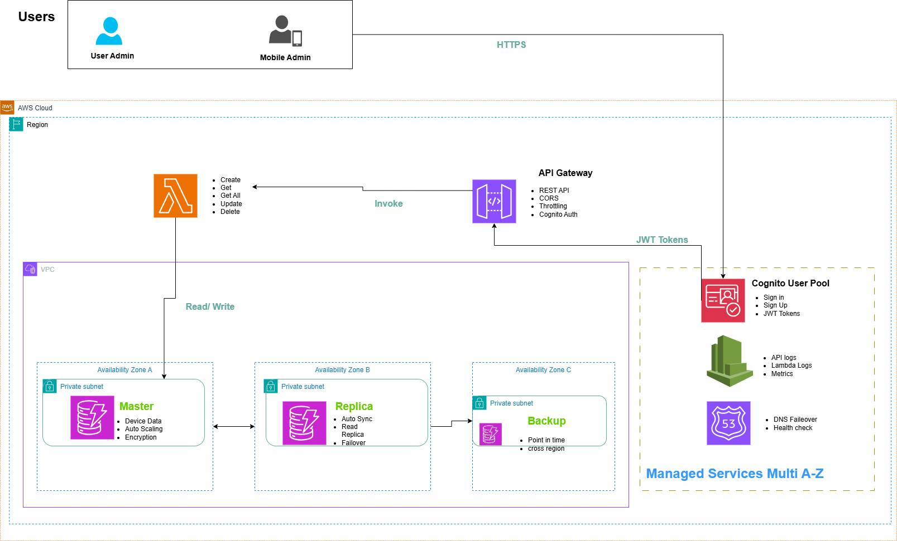

# Serverless Smart Home Device Management & Status API

## Project Description

The project constructs a **serverless REST API** that will be utilized to monitor and manage the virtual status of smart home devices within a home setting. The system, which is based on AWS serverless technology, offers a secure, scalable, and inexpensive backend for a smart home system with support for CRUD operations on device records. This API provides the data store for device inventory and their intended or reported states, supporting admin through a web portal as well as a mobile frontend application.

## Problem Statement

As smart home devices become more widespread, consumers may be left with increasingly more communicating devices from multiple vendors. Remote control, status monitoring, and inventory management become unwieldy without one integrated system. Current commercial solutions rely on leveraging third-party cloud services, leaving one to concern themselves with data privacy and vendor lock-in. In addition to this, for the person who wants to create bespoke smart home solutions or just have a private store of their devices, they need an extensible, secure, and flexible backend.

## Solution Overview

This project solves the problem using a private, serverless backend API on AWS to manage smart home device information. The solution relies on:

1.  **Centralized Device Inventory:** One place of truth for all registered smart home devices, i.e., their properties and current/desired states of operation.
2.  **Private and Secure Data Storage:** Leverage AWS services to keep data locked securely in the customer's own individual AWS account, less dependent on third-party services for primary data storage.
3.  **Scalable yet Affordable Architecture:** Leverage serverless components (API Gateway, Lambda, DynamoDB) that scale automatically with usage and bill only when in actual usage.
4.  **Flexible Access:** Offering a RESTful API that is accessible by both an admin portal via web and an app, offering remote convenience and control.
5.  **Focus on Backend Logic:** Focusing on the secure and sound backend API, distinguishing the complexity of direct physical device integration from focusing on reporting and data management.

This answer enables users to manage their smart home device data on their own, illustrating a real-world use case for basic AWS serverless services.

## Architectural Overview

The core of this solution is a serverless REST API, providing a stateless and highly scalable backend for smart home device management. User requests from either the administration portal or mobile application frontend are routed through Amazon API Gateway. API Gateway acts as the "front door," handling request routing, authentication, and authorization. These requests then trigger specific AWS Lambda functions, which contain the business logic for performing CRUD operations on device data. All device-related information is persistently stored in Amazon DynamoDB, a fully managed NoSQL database designed for high performance at any scale. AWS IAM ensures secure access control across all components, while Amazon CloudWatch provides comprehensive logging and monitoring capabilities for operational insights. The frontends (administration portal and mobile application) are static web applications hosted securely on Amazon S3.



## Key AWS Services Used

* **Amazon API Gateway**: Exposes smart home device management API REST endpoints. API Gateway serves as a single entry point for all API requests, such as routing, request-to-response mapping, and authorization.
* **AWS Lambda**: Runs backend code for all API operations (Create, Read, Update, Delete). API Gateway invokes Lambda functions as a response to API Gateway requests, which handle data processing and interaction with DynamoDB without server maintenance.
* **Amazon DynamoDB**: Is the NoSQL database utilized to store all smart home device data. Its managed infrastructure provides device data availability, scalability, and performance.
* **AWS IAM (Identity and Access Management)**: Deals with and provides access to AWS resources. IAM policies and roles are employed in offering permissions for Lambda functions to use DynamoDB and for API Gateway to call Lambda, in an effort to offer a secure methodology.
* **Amazon CloudWatch**: Offers monitoring and observability of the application. It aggregates Lambda and API Gateway logs, allowing performance monitoring, debugging, and alarm configuration for operational understanding.
* **Amazon S3 (Simple Storage Service)**: Hosts the static files (HTML, CSS, JavaScript) for the web-based admin portal and the mobile app frontend, offering highly available and scalable static content hosting.
* **Amazon Cognito**: Authenticates and verifies users for frontend applications. It offers user directories, manages sign-up/sign-in of users, and delivers JSON Web Tokens (JWTs) to be used by API Gateway for access.
* **Amazon Route 53**: An extremely available and scalable cloud Domain Name System (DNS) web service. Although not critical to the core functionality of the standard API in this setup by itself, it is commonly utilized for DNS routing and failover to keep it in a state of constant availability, particularly if custom domains are being utilized for the S3 static sites or API Gateway.

## Project Deliverables

As per the project requirements, the following deliverables are included in this repository:

* **Solution Architecture Diagram**: A visual representation of the solution architecture, located in `Solution-Diagram3.png`. Tools such as Lucidchart or any other free diagramming tools may be used.
* **GitHub Repository**: This public repository itself, containing all project documentation and code.
* **Complete Project Documentation**: This README file serves as the primary documentation, with additional details provided in the `documentation/` directory.
* **Source Code**: The Lambda function code for API operations, located in `lambda-functions/`. The frontend code for the administration portal and mobile application is in `frontend/`.
* **Infrastructure as Code (Optional but Recommended)**: CloudFormation/SAM templates for deploying the AWS infrastructure are located in `infrastructure-as-code/`.

### Backend Deployment (API Gateway, Lambda, DynamoDB)

1.  **Deploy DynamoDB Table**:
    * Create a new DynamoDB table named `SmartHomeDevices` with a primary key (e.g., `deviceId`).
    * (Alternatively, use the CloudFormation/SAM template provided in `infrastructure-as-code/` to automate this).
2.  **Package and Deploy Lambda Functions**:
    * Navigate to each Lambda function directory (e.g., `lambda-functions/create-device/`).
    * Package dependencies and deploy the function to AWS Lambda.
    * Ensure appropriate IAM roles are attached to Lambda functions allowing them to interact with DynamoDB.
    * (Recommended: Use `sam deploy --guided` from the `infrastructure-as-code/sam/` directory).
3.  **Configure API Gateway**:
    * Create a new REST API in Amazon API Gateway.
    * Define resources (e.g., `/devices`, `/devices/{deviceId}`) and HTTP methods (GET, POST, PUT, DELETE).
    * Integrate each method with the corresponding Lambda function.
    * Configure API Gateway security (e.g., IAM authorization).
    * Deploy the API to a stage (e.g., `dev` or `prod`) to obtain an Invoke URL.

### Frontend Deployment (Admin Portal & Mobile App Frontend)

1.  **Build Front-end Applications**:
    * Navigate to `frontend/admin-portal/` and `frontend/mobile-app-frontend/`.
    * Update the JavaScript code in each to point to your deployed API Gateway Invoke URL.
    * (If using frameworks, build the static assets).
2.  **Host on Amazon S3**:
    * Create two S3 buckets (e.g., `your-bucket-name-admin-portal` and `your-bucket-name-mobile-app`).
    * Enable Static Website Hosting for both buckets.
    * Upload the contents of each front-end directory to its respective S3 bucket.
    * Configure bucket policies to allow public read access for website hosting.

### Post-Deployment

* Test API endpoints using tools like Postman or `curl`.
* Access the deployed administration portal and mobile application frontends via their S3 static website URLs.
* Monitor logs in Amazon CloudWatch for any errors or insights.

## API Endpoints and Usage

The API provides a set of RESTful endpoints to manage smart home device records. All endpoints are accessed via the Amazon API Gateway Invoke URL. Authentication and authorization mechanisms (e.g., IAM roles, API Keys, or Cognito User Pools if added later) should be considered for production use.

| Method | Path               | Description                           | Request Body Example (for POST/PUT)                                         | Response Body Example (Success)                                                                                                   |
| :----- | :----------------- | :------------------------------------ | :-------------------------------------------------------------------------- | :-------------------------------------------------------------------------------------------------------------------------------- |
| `POST` | `/devices`         | Creates a new smart home device record. | ```json { "name": "Living Room Light", "type": "Light", "location": "Living Room", "status": "Off", "deviceId": "lrl-001" } ``` | ```json { "message": "Device created successfully", "device": { "name": "Living Room Light", ... } } ```                        |
| `GET`  | `/devices/{deviceId}` | Retrieves details for a specific device. | *(None)* | ```json { "deviceId": "lrl-001", "name": "Living Room Light", "type": "Light", "location": "Living Room", "status": "On" } ``` |
| `GET`  | `/devices`         | Retrieves a list of all devices.      | *(None)* | ```json [ { "deviceId": "lrl-001", "name": "Living Room Light", ... }, { "deviceId": "thrm-002", "name": "Bedroom Thermostat", ... } ] ``` |
| `PUT`  | `/devices/{deviceId}` | Updates an existing device record.    | ```json { "status": "On" } ``` (partial update)                            | ```json { "message": "Device updated successfully", "device": { "deviceId": "lrl-001", ... } } ```                           |
| `DELETE` | `/devices/{deviceId}` | Deletes a device record.              | *(None)* | ```json { "message": "Device deleted successfully" } ```                                                                          |

*Detailed API specifications, including error handling and full response schemas, can be found in `documentation/api-endpoints.md`.*

## Security Considerations

Security is paramount with any cloud application, let alone one that's handling personal environment data. This project is secure with AWS best practices by:

* **IAM Policies and Roles**: AWS Lambda functions and API Gateway are given least-privilege access via IAM roles, so they can only see the resources they need to (e.g., Lambda only writes to its CloudWatch logs and communicates with its own DynamoDB table).
* **API Gateway Security**: API Gateway can be set up with a variety of authorization methods (e.g., IAM authorization, Custom Authorizers, Amazon Cognito User Pools for prod) to control who is allowed to call the API endpoints.
* **DynamoDB Encryption**: By default, Amazon DynamoDB data is encrypted at rest using AWS Key Management Service (KMS). Data in transit is protected with HTTPS/SSL.
* **S3 Bucket Policies**: Frontend S3 buckets are set up with policies giving public read only for static web hosting and preventing write by unauthorized users.
* **Secrets Management**: Not being actively implemented here in this default implementation, in production, the sensitive data (e.g., API keys, database credentials if another DB is used) would be securely stored through AWS Secrets Manager or AWS Systems Manager Parameter Store.

*Further details on security implementation are available in `documentation/security.md`.*

## Monitoring and Logging

Leveraging Amazon CloudWatch, this solution provides comprehensive monitoring and logging capabilities to ensure operational visibility and facilitate troubleshooting:

* **Lambda Logs**: All Lambda function invocations and their output are automatically logged to CloudWatch Logs. This provides detailed insights into function execution, errors, and performance.
* **API Gateway Access Logs**: API Gateway can be configured to send access logs to CloudWatch Logs, capturing details about API requests, responses, and latency.
* **CloudWatch Metrics**: Key metrics for Lambda (invocations, errors, duration, throttles) and API Gateway (latency, 4xx/5xx errors) are automatically collected by CloudWatch.
* **Alarms **: CloudWatch alarms can be configured to notify administrators via Amazon SNS (Simple Notification Service) for critical events, such as high error rates or unusual latency spikes in the API. 

*For more in-depth information on monitoring and logging configurations, refer to `documentation/monitoring-logging.md`.*

## Missing Code Updates:
* **CORS:** it is set now to * this is ok for Dev but not for production and in the API gateway configuration as well
* **Auto scaling:** we need to define the auto scaling configuration
* **Logging:** sending the custom logs to cloud watch is not configured yet
* **Database:** replication and Backup is to be configured
* **Observability:** we might set some alerts and add X-ray to the solution
* **Lambda:**  retries or DLQ defined yet
* ** Lambda:** resource allocation might be paramatrized not fixed

## Future Enhancements

This project provides a solid foundation for a smart home device management system. Potential future enhancements could include:

* **User Authentication**: Implement Amazon Cognito User Pools for robust user authentication and authorization for the API and frontends.
* **Real-time Updates**: Integrate AWS IoT Core or WebSockets (via API Gateway) to enable real-time status updates from physical devices or push notifications to clients.
* **Device Control Integration**: Develop Lambda functions that interact with actual smart home device APIs (e.g., Philips Hue, SmartThings) to enable direct control beyond just status management.
* **Data Analytics**: Utilize Amazon Kinesis Firehose and Amazon S3 for data lake capabilities, then Amazon Athena or QuickSight for analytics on device usage patterns.
* **Advanced Monitoring**: Set up custom CloudWatch dashboards and alarms for specific operational metrics.
* **CI/CD Pipeline**: Implement a Continuous Integration/Continuous Delivery pipeline using AWS CodePipeline and CodeBuild for automated testing and deployment.
* **Custom Domain**: Configure a custom domain name for the API Gateway endpoint and S3 static websites using Amazon Route 53 and AWS Certificate Manager.
* **Caching:** might add cloud front
* ** resources:** cleanup script

* 
